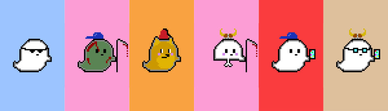

<p align="center">
  <a></a>
</p>
<p align="center">
  <b>
    Gentle Ghosts Images & MetaData
  </b>

  <br>
  <br><i>An archive of all 5000 Gentle Ghosts: <a href="/optimized-images">optimized</a>, <a href="/images">full</a>, and <a href="/metadata">metadata</a></i>
</p>

<br/>

## How to use this repo

Want the image and the metadata for ghost #0?

### Image

`/optimized-images/100x100/0.png` contains


`/optimized-images/200x200/0.png` contains


`/optimized-images/600x600/0.png` contains


⚠️ Never use`/images` unless you are resizing them. They are 10,000x10,000 pixels ⚠️

### MetaData

`/metadata/0.json` contains

```json
{
  "image": "https://ipfs.io/ipfs/bafybeieufw2p5gz3zeocyf4vkfpudexkse3wzqriwoggwbr77btwnyjm4e/0.png",
  "tokenId": 0,
  "name": "Gentle Ghosts 0",
  "attributes": [
    {
      "trait_type": "Background",
      "value": "Pink"
    },
    {
      "trait_type": "Body",
      "value": "Zombie"
    },
    {
      "trait_type": "Hat",
      "value": "Backwards Cap"
    },
    {
      "trait_type": "Misc",
      "value": "Scythe"
    }
  ]
}
```

<br/>

### LICENCE

Gentle Ghost holders are given commercial rights to their specific ghost. You can sell its likeness or make derivatives of it. You can give others permission to use it. It’s yours. You are free to do anything with them under a non-exclusive or exclusive license.

We’ve given licensing rights over for the ghosts, but not our logo, name (Gentle Ghosts), site images, or other marketing material. Basically, if it isn’t your ghost, it isn’t your Intellectual Property.

We don’t mind personal use or fan art usage of our logos and brand, just so long as you don’t try and sell them. The bottom line here is to protect the club, it is important that someone can’t pretend to be Gentle Ghosts and that they can’t pretend to be collaborating with us.
